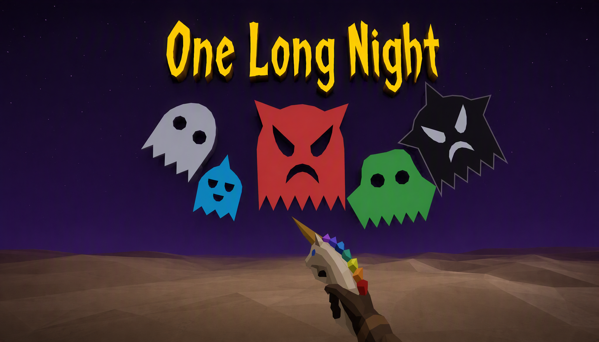

# One Long Night



A **js13kGames 2026** entry, on the theme *Unicorns and Rainbows*. The whole game
is a single HTML file of **under 13KB** - no images, no audio files, no fonts, no
network. Everything on screen is drawn from code at runtime.

---

## 🦄 What is One Long Night?

A stationary first-person roguelike wave shooter.

You stand in an open field with the Alicorn Gun in your hand. Ghosts converge on
you from every direction, one wave after the next, and **you cannot move**. The
horn fires on its own. The rainbow is yours to time.

---

## 🎯 Goal

**Survive as many waves as you can.** A wave sends a different number of ghosts
every time it is played.

A wave ends when the field is clear. Then you pick one of three power ups, and
then the next wave starts.

There is no pause.

---

## ❓ How to Play

**Kill the wave, then choose how you get stronger.**

Each wave has a threat level that grows on the last, so a late wave is not only
bigger, it comes at you faster.

One weapon, two powers, and they answer different problems:

**The horn** fires by itself, at whatever rate you have bought. It is single
target and it out-ranges the arena, so nothing is ever too far to shoot - the
only thing between you and a kill is having turned to face it.

**The rainbow** is an area. Hold to charge for three seconds and it fires itself
in a ring centred on you. It answers crowds, which is the one thing a
single-target horn cannot.

Five kinds of ghost arrive over the run, one new type every five waves, each with
its own speed, health and damage.

---

## 🎮 Controls

**Desktop only.**

| Action | Input |
|---|---|
| Aim and turn | Drag, or `WASD`, or the arrow keys |
| Fire the horn | Automatic |
| Charge the rainbow | Hold click, or hold `Space` |
| Pick a card | Click it, or `1` `2` `3`, or arrows and `Space` (or `Enter`) |
| Mute | `M`, or the M button |
| Quit to the menu | `Esc`, or the arrow button |

---

## 📦 The Size and Byte Budget

The whole game is one `index.html`, zipped, at a little under **13,000 bytes**
against a limit of 13,312.

The packer's optimiser searches rather than calculates, so the exact figure moves
by a dozen bytes between builds of identical source. `npm run size` prints what
the build you just made actually came to.

The build inlines the JS and CSS, minifies with terser, packs with Roadroller and
recompresses the zip with advzip. The packed file is pure 7-bit ASCII.

`npm run size` prints the count after every build and refuses to look healthy
when it is not. It also reads the zip's central directory to assert `index.html`
really is at the top level, which is a competition rule and not something to take
on trust.

**No external resources of any kind.** System font stack, no webfont, procedural
audio, and every graphic drawn at runtime - including the title, which is cut
from strokes on a grid rather than set in a typeface, so it renders identically
on every machine.

---

## 🖥️ How to Run the Game

Node 20 or newer.

```sh
npm install

npm run dev      # dev server, play at the URL it prints
npm run build    # writes dist/index.html and dist/index.zip
npm run size     # build, then report bytes against the limit
npm run check    # the full suite: build, 628 checks, both browsers, size
```

`npm run check` is the one that matters. It builds the real file, runs every
check, then loads the **packed** output in headless Firefox and Chrome and
asserts that each of them draws something, is still drawing a second later, and
logged nothing at all. A game that throws no errors and paints a frozen frame
passes a console check and is still broken, so it measures both.

It needs Firefox and Chrome on the machine. Set `FIREFOX=` or `CHROME=` to point
at them if they are somewhere unusual.

---

## 📜 A Map of the Repo

```
index.html         the shell: a canvas and a script tag
src/main.js        the entire game, in one file
DESIGN.md          the design spec, and the record of where it was wrong
README.md          this file
Poster.png         the poster above
tests/             the checks
tools/             the build
package.json       the scripts, and three dev dependencies
vite.config.js     the build entry, which defers to tools/config.js
.gitignore         dist/ is built, not committed - run the build to make it
```

**`src/main.js` is one long file on purpose.** Every byte of module plumbing is a
byte not spent on the game, and at this size a single file is also easier to read
straight through than the same code split six ways. It opens with a `C` object
holding every tunable constant in the game, and the comments carry the reasoning
rather than restating the code - what was tried, what it measured, and why the
number is what it is.

`tests/loop.mjs` is the bulk of the suite. It stubs a canvas, records every
drawing call, drives the real module through real input, and asserts against what
was actually drawn. The rest are focused: `browsers.mjs` runs the shipped file in
two real browsers, `audit.mjs` checks the competition rules, `render.mjs` and
`gate.mjs` cover drawing and the desktop gate, and `playtest.mjs` drives complete
runs to measure difficulty rather than guess at it.

`tools/config.js` is the build configuration, `inline.js` folds everything into
one file, and `size.js` is the byte report.

---

## 🤝 Licence

Code is free to read and learn from. The game and its art are the author's.
